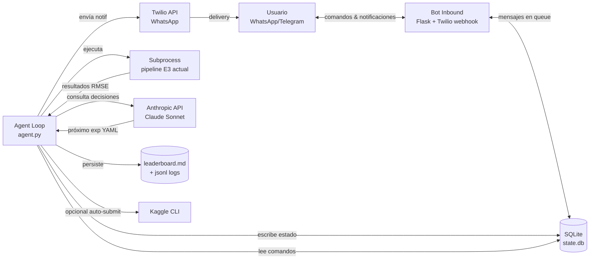

# Agentic workflow — esbozo (no implementado)

> Status: sólo diseño. NO se construyó nada todavía. Implementación
> agendada para después de cerrar E3 / E4 mínimamente, idealmente
> antes de arrancar Entrega Final donde la velocidad de iteración
> empieza a importar más que en las parciales.

---

## 1. Qué resuelve

Hoy cada experimento implica que yo (humano) lo arranque, espere,
mire el resultado, escriba el próximo, etc. En E3 con 8-10 versiones
proyectadas y CV5 multi-seed que tarda > 1 h por corrida, eso son
~10 horas mías sentado mirando logs.

La idea: un agente que tome la cola de experimentos, los ejecute,
me notifique resultados, y use un LLM para sugerir el próximo
experimento basado en el histórico. Yo lo comando desde el celular
(WhatsApp / Telegram) sin tener que estar frente a la compu.

Encuadre académico: **NO es contenido del TP** (no es FE, ni
modelo, ni reducción de dimensionalidad). Es una herramienta de
tooling personal. Si se usa durante EF se reporta en el informe
("iteré N hipótesis en X días con un agente custom, cada decisión
del LLM loguedada en `agentic_log.jsonl` para auditoría") como
honestidad metodológica.

---

## 2. Casos de uso

**Escenario A — HP sweep desatendido**
Le cargo una grilla de 30 combinaciones `(n_estimators, max_depth)`,
me voy a dormir, a la mañana tengo en WhatsApp un mensaje:
"Sweep terminado, mejor combo `(800, 25)` con CV5 87.2k (mejora
1.4k vs champion v4). ¿Submitto a Kaggle? Quedan 4/5 submits del día."

**Escenario B — Iteración guiada por LLM**
Termina v12 con resultado peor de lo esperado. El agente le pide
a Claude: "esto fue lo que probamos, esto fue el resultado, este
es el plan E3 actual, esto es lo que ya está en el backlog. Dame
el próximo experimento como YAML." Yo recibo en WhatsApp la
propuesta + justificación, respondo "ok" o "no, mejor probemos X",
y el agente lo encola.

**Escenario C — Babysitting de un run largo**
Mientras corre Creacionismo (una hipotética future implementation
que tardaría 4-8 h), cada hora me manda heartbeat:
"Generación 3/5 terminada, 47 features sobrevivieron a canaritos,
ETA 2h 10min." Si crashea, mensaje inmediato con stderr.

**Escenario D — Consulta on-the-go**
Voy en el subte y se me ocurre algo. Mando "/ask ¿qué pasaría si
discretizamos m2 con qcut en lugar de cut?" El agente responde con
contexto del proyecto cargado.

---

## 3. Arquitectura



### Componentes

| Componente | Responsabilidad | Stack tentativo |
|---|---|---|
| **Agent Loop** | Loop principal: lee cola → ejecuta exp → captura resultado → consulta LLM → notifica. Heartbeat cada N min. | Python + `asyncio` + `subprocess` |
| **State (SQLite)** | Cola de exps, histórico de runs, mensajes inbound pendientes, decisiones del LLM, lock de "una corrida a la vez". | `sqlite3` stdlib |
| **Bot Inbound** | Recibe mensajes del usuario vía webhook, los parsea, los mete en `state.db` para que el Agent Loop los procese. | Flask + Twilio Python SDK |
| **Outbound** | El propio Agent llama a Twilio API para mandar notificaciones. | Twilio SDK |
| **LLM Decision** | Le pasa contexto (últimos N runs, leaderboard, plan E3, CONTEXT.md relevante) y pide próxima propuesta como YAML estructurado. | Anthropic Messages API |
| **Runner** | Ejecuta el pipeline existente (notebook → script extraído, o `papermill`). Captura RMSE / Kaggle score. | `subprocess` + `papermill` (opcional) |
| **Safety layer** | Rate limits (Kaggle 5/día, LLM presupuesto $/día), confirmación humana para acciones sensibles, lista blanca de números autorizados. | Lógica propia en Agent Loop |

---

## 4. Stack técnico tentativo

### Mensajería: Telegram primero, WhatsApp después

Recomendación para MVP: **Telegram**.

| | Telegram | WhatsApp (Twilio) | WhatsApp (Meta Cloud) |
|---|---|---|---|
| Costo | Gratis | $0.005-0.05/msg | Gratis hasta 1k conv/mes |
| Setup | 10 min (`@BotFather`) | 1-2 h (cuenta Twilio + sandbox + número) | 4-8 h (Meta Business + verificación) |
| Librería Python | `python-telegram-bot` (excelente) | `twilio` SDK | `httpx` directo |
| Adopción del usuario | Instalar Telegram | Ya lo tengo | Ya lo tengo |
| Recomendación | ✅ MVP | V2 si querés WA | V3 si querés cero costo |

Diseño con `Messenger` interface abstraído → migración Telegram → WhatsApp es trivial (cambiar implementación de la clase).

### LLM: Anthropic API directa

| | API directa | Claude Code SDK | Local (Ollama + Llama) |
|---|---|---|---|
| Costo por decisión | ~$0.05 (5k in + 1k out, Sonnet) | ~$0.10 (más tokens por tools) | $0 |
| Latencia | 2-5 s | 5-15 s | 30-60 s |
| Tools | No (sólo razona) | Sí (read/edit files, run shell) | No |
| Calidad | Excelente | Excelente | Mediocre |
| Recomendación | ✅ MVP (decisiones simples) | V2 (cambios de pipeline) | Nunca para esto |

Cálculo MVP: 10-20 decisiones/día × $0.05 = $0.50-1/día = **~$20/mes**. Aceptable.

### Persistencia: SQLite

Schema mínimo:

```sql
CREATE TABLE experiments (
  id INTEGER PRIMARY KEY,
  config_yaml TEXT NOT NULL,
  status TEXT NOT NULL,  -- queued / running / done / failed / cancelled
  created_at TIMESTAMP DEFAULT CURRENT_TIMESTAMP,
  started_at TIMESTAMP,
  finished_at TIMESTAMP,
  rmse_cv5 REAL,
  rmse_holdout REAL,
  kaggle_score REAL,
  log_path TEXT,
  decision_id INTEGER  -- FK a decisions
);

CREATE TABLE decisions (
  id INTEGER PRIMARY KEY,
  ts TIMESTAMP DEFAULT CURRENT_TIMESTAMP,
  trigger TEXT,  -- 'auto_after_run' / 'user_request' / 'scheduled'
  context_summary TEXT,
  llm_prompt TEXT NOT NULL,
  llm_response TEXT NOT NULL,
  proposed_exp_yaml TEXT,
  human_action TEXT  -- 'approved' / 'rejected' / 'modified' / 'pending'
);

CREATE TABLE messages (
  id INTEGER PRIMARY KEY,
  ts TIMESTAMP DEFAULT CURRENT_TIMESTAMP,
  direction TEXT,  -- 'in' / 'out'
  channel TEXT,    -- 'telegram' / 'whatsapp'
  content TEXT,
  processed BOOLEAN DEFAULT 0
);

CREATE TABLE state (key TEXT PRIMARY KEY, value TEXT);
-- e.g. ('agent_status', 'running'), ('current_exp_id', '12'), ('paused', 'false')
```

---

## 5. Comandos por WhatsApp / Telegram

| Comando | Descripción | Acción |
|---|---|---|
| `/status` | Estado actual | Devuelve idle/running, exp actual, ETA, queue size |
| `/queue` | Lista de pendientes | Muestra próximos 5 exps de la cola |
| `/results [n]` | Últimos N resultados | Tabla con CV5/holdout/Kaggle de últimos N exps |
| `/champion` | Champion actual | RMSE + features + HP |
| `/leaderboard` | Link al `leaderboard.md` | Manda contenido del MD |
| `/pause` | Pausa al terminar el actual | Cambia state, no mata el actual |
| `/resume` | Reanuda | Vuelve a procesar la cola |
| `/cancel <id>` | Mata el exp en curso | Manda SIGTERM, marca cancelled |
| `/run <yaml>` | Encola un exp custom | Parsea YAML, agrega a la cola |
| `/propose` | Fuerza al LLM a proponer | Trigger manual de decision |
| `/ask <q>` | Pregunta libre al LLM | Round con contexto, sin acción |
| `/approve <id>` | Aprueba una propuesta pendiente | Encola la propuesta |
| `/reject <id>` | Rechaza propuesta | Marca rejected en `decisions` |
| `/budget` | Costo LLM hoy / mes | Track de spend |
| `/help` | Lista de comandos | — |

Mensajes **proactivos** del agente (sin que se los pida):

- **Heartbeat** (configurable, default cada 4 h): "Sigo vivo. Exp `v12` corriendo desde hace 1h 23min, ETA 47min, RMSE parcial 91.2k."
- **Fin de exp**: "✅ `v12` terminó. CV5: 88.4k (Δ -1.2k vs champion). Holdout: 87.9k (Δ -0.8k). ¿Submit? (5/5 disponibles hoy)"
- **Crash**: "⚠️ `v12` falló. stderr: `[última 20 líneas]`. ¿Investigar / saltar / reintentar?"
- **Propuesta nueva**: "💡 Después de `v12`, sugiero `v13`: agregar `score_lujo` + tunear `n_estimators=600`. Justificación: la importancia de las binarias bajó vs v11 → un agregado puede comprimir mejor. ¿Apruebo?"
- **Anomalía**: "🔍 Detecté que `v10` y `v11` tienen CV5 casi idéntico pero holdout muy distinto. Posible overfit a folds. ¿Querés que corra holdout multi-seed antes de seguir?"

---

## 6. Roadmap

### MVP (4-6 horas de implementación, todo Python local)

- [ ] Schema SQLite + helpers CRUD
- [ ] `agent.py` loop secuencial: lee cola → ejecuta subprocess → captura RMSE de stdout → escribe a `experiments` table
- [ ] Bot Telegram con `python-telegram-bot`: `/status`, `/queue`, `/run`, `/results`, `/pause`, `/resume`
- [ ] Notificaciones outbound al final de cada exp
- [ ] Lock para evitar dos runs simultáneos
- [ ] Reintentar lectura de cola cada 30 s

**No incluye**: LLM (las decisiones las tomo yo). Es básicamente un job runner con notificaciones.

### V1 (otras 4-6 horas)

- [ ] Integración Anthropic API directa
- [ ] Función `propose_next_experiment()` con prompt template:
  ```
  Sos el agente que asiste a Patricio en el TP de DM UBA Exactas.
  Acá está el plan E3 actual: <plan.md>
  Estos son los últimos 5 experimentos: <table>
  Este es el champion actual: <champion_meta>
  Estas son las hipótesis abiertas del backlog relevantes a E3: <slice>

  Proponé el próximo experimento como YAML conforme a este schema:
  <schema>
  Justificá en 2-3 frases por qué este es el siguiente paso óptimo.
  ```
- [ ] Comando `/propose`, `/approve`, `/reject`
- [ ] Logging de decisiones en `decisions` table → auditable
- [ ] Heartbeat cada N horas

### V2 (más tiempo)

- [ ] Migración Telegram → WhatsApp (Twilio)
- [ ] Modo "autopilot" (decisiones de bajo riesgo se ejecutan sin confirmación)
- [ ] Auto-submit a Kaggle (respeta rate limit)
- [ ] Dashboard web read-only con WebSocket (para mirar desde la compu sin abrir mensajes)
- [ ] Recovery: si el agente crashea, al reiniciar levanta el estado desde SQLite

### V3 (overkill, tal vez nunca)

- [ ] Claude Code SDK para acciones que requieren editar archivos (cambiar el pipeline, no sólo HP)
- [ ] Multi-agente: "creativo" propone, "crítico" valida, "ejecutor" corre
- [ ] Agente en cloud (Hetzner CX21 €5/mo) ejecutando en tu local vía SSH worker
- [ ] CI/CD: cada exp exitoso → branch `experimentos/v<n>` automática

---

## 7. Riesgos y mitigaciones

| Riesgo | Severidad | Mitigación |
|---|---|---|
| LLM toma decisión mala y submitea a Kaggle algo peor | 🔴 alta | Auto-submit OFF por default; siempre requiere `/approve` humano. Auto-submit sólo se prende para HP sweep dentro de un rango ya validado. |
| Kaggle rate limit (5/día) consumido por experimentos malos | 🟡 media | Tracker de submits del día en `state` table. Bloquear si se llega al límite. |
| Costo LLM se descontrola | 🟡 media | Hard cap diario en `state` (ej. $5/día). Si se supera, agente pausa decisiones LLM y notifica. |
| WhatsApp/Telegram caído → no recibo notif | 🟢 baja | Fallback: agente también escribe a `notifications.log` local. Email secundario opcional. |
| Acceso no autorizado al bot (alguien manda comandos) | 🔴 alta | Lista blanca de chat IDs / números autorizados, harcoded. Comandos sensibles (`/run`, `/cancel`) requieren código de confirmación enviado a otro canal. |
| Reproducibilidad: nadie puede repetir las decisiones del LLM | 🟡 media | Toda decisión LLM se loguea con prompt completo + respuesta + acción tomada → `decisions` table es la fuente de verdad. Se puede replayear. |
| Mi máquina se duerme / se apaga / WiFi se cae | 🟢 baja MVP | Aceptable: el agente reanuda al volver. Para V2 → cloud. |
| Dos agentes corriendo en paralelo (ej. olvido apagar uno y largo otro) | 🟡 media | Lockfile en `~/.cursor/agent.lock` con PID. Al iniciar, verificar que no haya otro vivo. |

---

## 8. Costo estimado

| Concepto | Costo mensual |
|---|---|
| LLM (Anthropic Sonnet, 10-20 decisiones/día) | ~$15-30 |
| Telegram bot | $0 |
| WhatsApp Twilio (V2, ~5 msg/día) | ~$2-5 |
| Cloud VM (V2, opcional) | $5 (Hetzner CX21) o $0 (Oracle Free Tier) |
| **Total MVP** | **~$15-30/mes** |
| **Total V2** | **~$25-40/mes** |

Aceptable para el contexto del TP.

---

## 9. Open questions (decidir antes de implementar)

1. **¿Telegram o WhatsApp para MVP?** → Recomendación: Telegram. Decidir.
2. **¿Cuándo lo arranco?** → Sugerencia: después de cerrar E3, antes de E4.
   E3 está cerca de terminar y arrancar el agente ahora mete riesgo en
   un período donde la entrega está caliente.
3. **¿Modo "asistido" o "autopilot" para V1?** → Recomendación: asistido
   (toda decisión requiere `/approve`). Migrar a autopilot recién en EF
   cuando ya haya histórico de qué tipos de decisiones del LLM son
   confiables.
4. **¿LLM-as-judge para validar resultados sospechosos?** → Patrón útil:
   antes de marcar un exp como "champion nuevo", el agente le pide a Claude:
   "esta mejora de RMSE de X a Y, ¿es plausible o sospechosa de leakage /
   bug?" Útil para evitar repetir el desastre de v2 / v3 con `precio_mediano_barrio`.
5. **¿Vale la pena agregar Slack como tercer canal?** → Probablemente no para
   uso personal. Sí si en EF colaboro con alguien.
6. **¿Voice input por WhatsApp con Whisper?** → Tentador para "/ask" mientras
   manejo, pero lo postergaría a V3.
7. **¿Cómo manejar el side-channel "mientras estoy en clase y se me ocurre
   algo"?** → Comando `/note <texto>` que appendea a un `ideas_inbox.md` que el
   agente revisa antes de proponer próximo exp. Cero acción inmediata, sólo
   contexto adicional para futuras decisiones.

---

## 10. Inspiración

- **Cursor Background Agents**: ya hace algo parecido para tareas de código.
  Ver si conviene reutilizar el infra de eso o construir desde cero.
- **Claude Code SDK**: para V2/V3 si quiero que el agente edite el pipeline.
- **Sweep frameworks** (Weights & Biases, Optuna): hacen el "ejecutar grilla
  de HP", no la parte conversacional ni LLM-driven. Útil de inspiración para
  el componente Runner.
- **AutoML clásico** (auto-sklearn, FLAML): hace search ciega, lo nuestro es
  search guiada por LLM con contexto del proyecto. Diferente filosofía.
